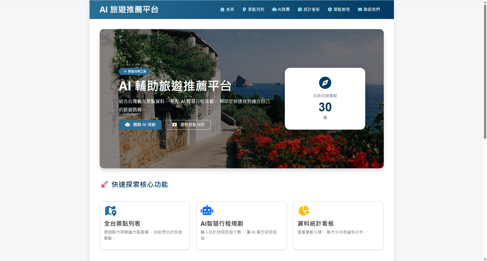
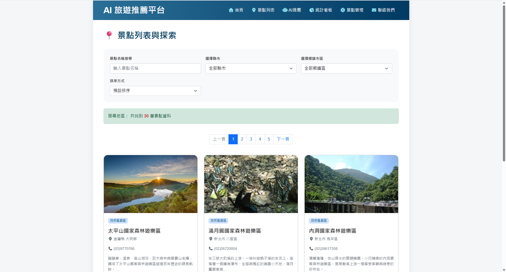
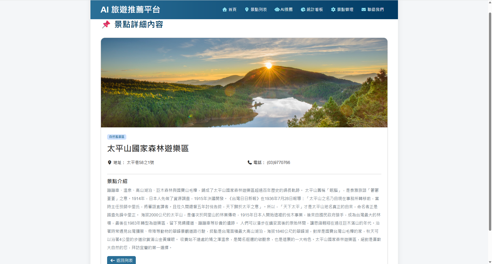
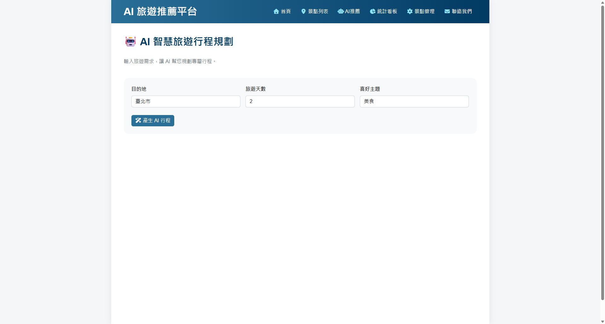
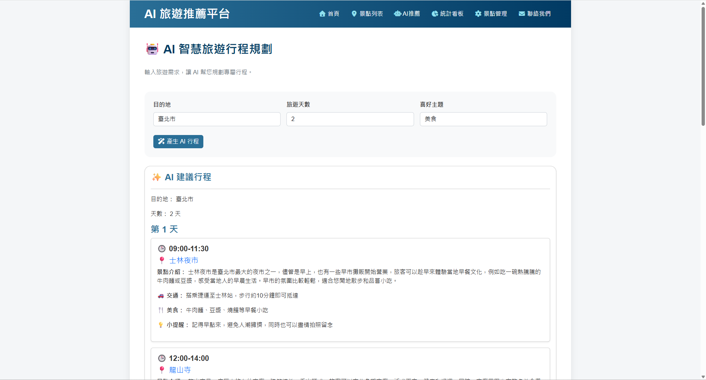
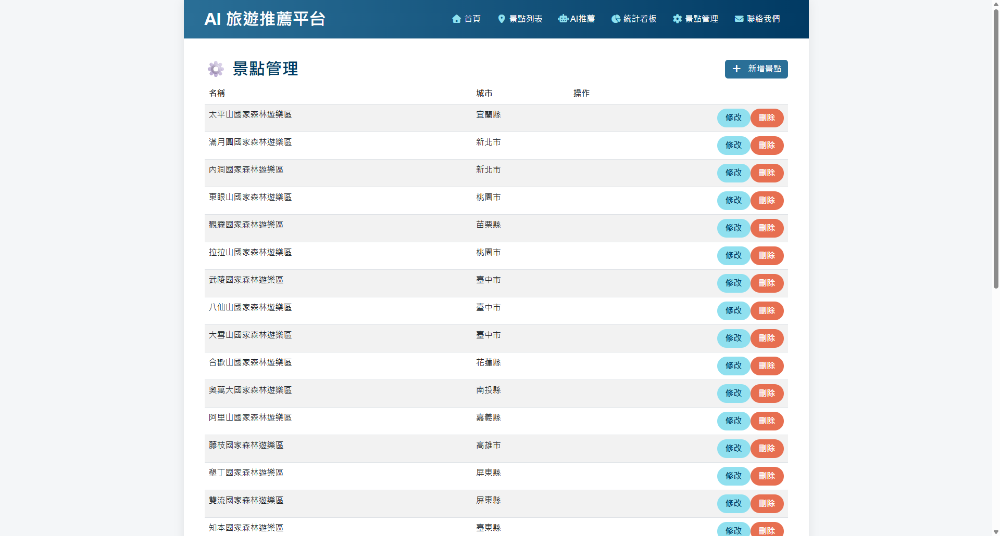
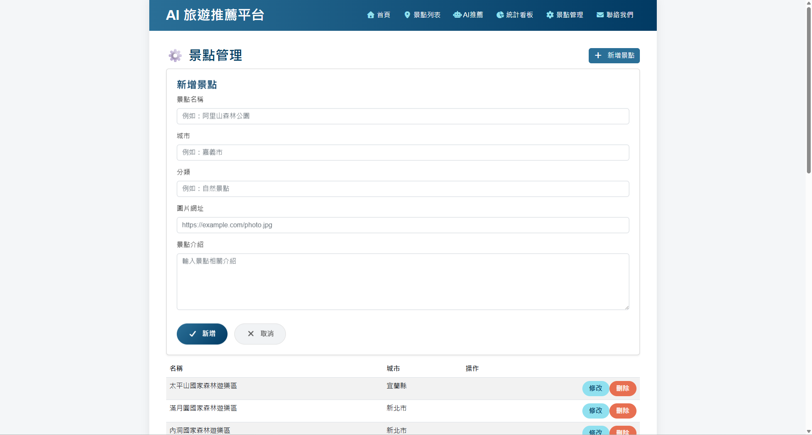
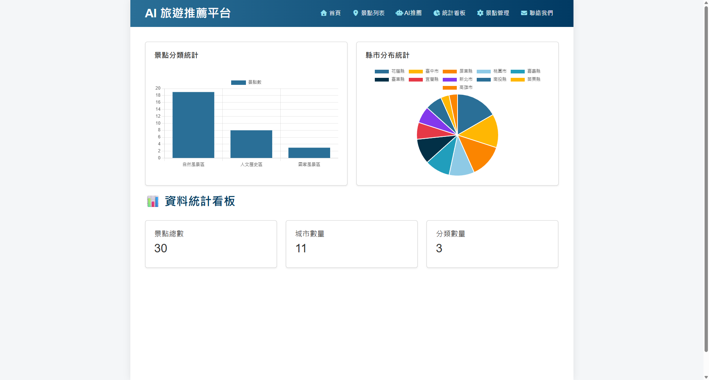
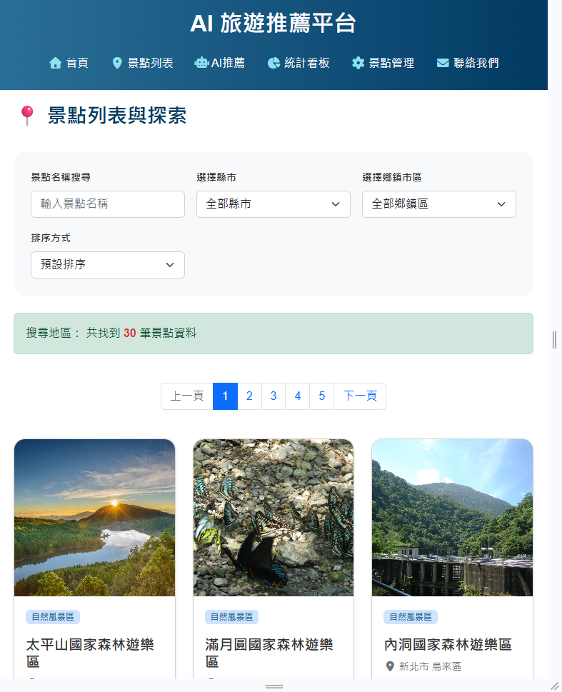
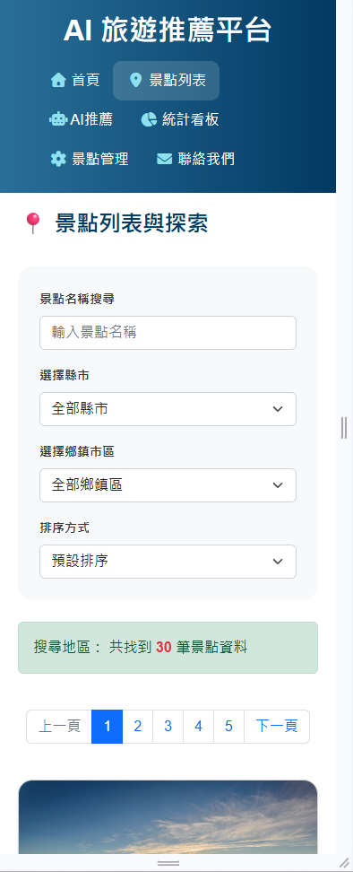

## 專題簡介

本專題是一個「**AI 輔助旅遊景點推薦平台**」，以台灣旅遊景點資料為核心，提供景點瀏覽、搜尋、篩選、排序、詳細資訊、景點管理、統計分析，以及 AI 智慧旅遊行程規劃等功能。

前端使用 **Vue.js 3** 建立單頁式互動介面，搭配 **Bootstrap 5** 進行 RWD 響應式版面設計，並使用 **Font Awesome** 提供圖示。

後端使用 **Python Flask** 建立 Flask API，景點資料則使用 **SQLite** 儲存。前端透過 **Axios** 與 Flask API 溝通，取得景點、統計資料以及 AI 行程推薦結果。

系統主要目標是讓使用者能夠快速探索台灣各地景點，並透過 AI 根據目的地、旅遊天數與個人喜好產生旅遊行程建議。

---

## 使用技術

| 類別         | 使用技術                            |
| ---------- | ------------------------------- |
| 前端         | HTML5、CSS3、Bootstrap 5、Vue.js 3 |
| JavaScript | JavaScript、Axios                |
| 圖示         | Font Awesome                    |
| 圖表         | Chart.js                        |
| 後端         | Python、Flask                    |
| 資料庫        | SQLite                          |
| API        | Flask API                     |
| AI 功能      | Flask AI Recommendation API     |
| 版本管理       | Git、GitHub                      |

---

## 系統功能說明與頁面

| 頁面／功能  | 功能說明                              | 建議截圖                               |
| ------ | --------------------------------- | ---------------------------------- |
| 首頁     | 顯示平台介紹、AI 行程規劃入口、景點列表入口、熱門城市與精選景點 | `screenshots/home.png`        |
| 景點列表   | 顯示所有景點，可依名稱、縣市、鄉鎮市區進行搜尋與篩選        | `screenshots/attractions.png` |
| 景點詳細內容 | 顯示景點圖片、名稱、地址、電話、分類與介紹             | `screenshots/detail.png`      |
| AI推薦   | 輸入目的地、旅遊天數與喜好後產生 AI 行程            | `screenshots/ai.png`          |
| 景點管理   | 提供景點新增、修改與刪除功能                    | `screenshots/admin.png`       |
| 統計看板   | 顯示景點總數、城市數量、分類數量及圖表               | `screenshots/charts.png`      |

---

# 專案畫面截圖
---
## 首頁



---

## 景點列表



---

## 景點詳細內容



---

## AI 行程推薦



使用者輸入旅遊需求後，由 AI API 產生推薦行程。



---

## 景點管理




提供：

* 新增
* 修改
* 刪除

---

## 統計圖表



---

## RWD 檢查

### 桌機 1200px


---

### 平板 768px



---

### 手機 375px



---

# 資料庫設計說明

本專題使用 **SQLite** 作為資料庫。資料庫檔案為 travel.db。程式啟動時會自動建立資料表與預設資料。

---

## attractions 景點資料表


| 欄位          | 型別      | 說明      |
| ----------- | ------- | ------- |
| id          | INTEGER | 主鍵、自動編號 |
| name        | TEXT    | 景點名稱    |
| city        | TEXT    | 縣市      |
| town        | TEXT    | 鄉鎮市區    |
| category    | TEXT    | 景點分類    |
| image       | TEXT    | 景點圖片網址  |
| description | TEXT    | 景點介紹    |
| phone       | TEXT    | 聯絡電話    |
| address     | TEXT    | 景點地址    |

---

## 資料表關聯

目前前端程式直接使用：

```javascript
item.category
```

因此目前前端是以景點資料本身的 `category` 欄位取得分類。

如果後續將分類獨立成 `categories` 資料表，可以改為：

```text
attractions.category_id
        ↓
categories.id
```

如此可以避免分類資料重複並方便後續管理。

---

# API 說明

目前前端程式實際呼叫的 Flask API 如下：

| 方法     | API 路徑                      | 功能         | 前端使用位置      |
| ------ | --------------------------- | ---------- | ----------- |
| GET    | `/api/health`          | 檢查 API 是否正常運作     | 系統健康檢查 |
| GET    | `/api/attractions`          | 取得景點資料     | 首頁、景點列表、管理頁 |
| POST   | `/api/attractions`          | 新增景點       | 景點管理        |
| PUT    | `/api/attractions/<id>`     | 修改景點       | 景點管理        |
| DELETE | `/api/attractions/<id>`     | 刪除景點       | 景點管理        |
| GET    | `/api/dashboard/statistics` | 取得統計資料     | 統計看板        |
| POST   | `/api/ai/recommend`         | 取得 AI 行程推薦 | AI推薦        |


# GET /api/attractions

取得景點資料。

前端目前呼叫：

```javascript
axios.get("http://127.0.0.1:5000/api/attractions")
```

預期回傳格式：

```json
{
    "attractions": [
        {
            "id": 1,
            "name": "景點名稱",
            "city": "臺中市",
            "town": "西屯區",
            "category": "自然景觀",
            "image": "圖片網址",
            "description": "景點介紹",
            "phone": "04-12345678",
            "address": "臺中市..."
        }
    ]
}
```

---

# POST /api/attractions

新增景點。

前端：

```javascript
axios.post(
    "http://127.0.0.1:5000/api/attractions",
    vm.formSpot
)
```

傳送資料範例：

```json
{
    "name": "新景點",
    "city": "臺中市",
    "category": "自然景觀",
    "image": "https://example.com/image.jpg",
    "description": "景點介紹",
    "phone": "04-12345678",
    "address": "臺中市..."
}
```

---

# PUT /api/attractions/<id>

修改指定景點。

例如：

```text
PUT /api/attractions/1
```

前端會將目前編輯中的 `formSpot` 傳送至後端。

---

# DELETE /api/attractions/<id>

刪除指定景點。

例如：

```text
DELETE /api/attractions/1
```

使用者確認刪除後才會送出 API Request。

---

# GET /api/dashboard/statistics

取得統計看板所需要的資料。

前端：

```javascript
axios.get(
    "http://127.0.0.1:5000/api/dashboard/statistics"
)
```

前端預期使用：

```json
{
    "statistics": {
        "total": 100,
        "categoryStats": [
            {
                "category": "自然景觀",
                "count": 30
            },
            {
                "category": "文化古蹟",
                "count": 20
            }
        ],
        "cityStats": [
            {
                "city": "臺中市",
                "count": 25
            },
            {
                "city": "臺北市",
                "count": 20
            }
        ]
    }
}
```

---

# POST /api/ai/recommend

AI 行程推薦 API。

前端會傳送：

```json
{
    "destination": "臺北市",
    "days": 2,
    "preference": "美食"
}
```

API：

```text
POST /api/ai/recommend
```

AI 回傳後，Vue 將結果存入：

```javascript
aiResult
```

再由畫面動態產生每日行程。

---

# AI 功能說明

本專題的 AI 功能主要應用於「智慧旅遊行程規劃」。

使用者可以輸入：

```text
目的地
旅遊天數
喜好主題
```

例如：

```text
目的地：臺中市
旅遊天數：2 天
喜好主題：美食、自然
```

AI 可以根據使用者條件產生：

* 每日旅遊行程
* 推薦景點
* 景點介紹
* 交通方式
* 美食建議
* 旅遊提醒

---

## AI Prompt 範例

### 旅遊行程

```text
請規劃臺中市 2 天 1 夜旅遊行程，
旅遊偏好為美食與自然景觀，
請安排每天的景點、交通方式、推薦美食以及旅遊提醒。
```

### 景點介紹

```text
請用適合旅遊網站的方式，
介紹臺中市一個熱門景點，
內容約 100 字，並說明景點特色與推薦旅遊方式。
```

### 行程推薦

```text
請根據使用者喜歡美食與自然景觀的需求，
推薦臺北市兩天旅遊行程，
每天安排上午、下午與晚上的活動。
```

---


# 安裝與執行方式

## 1. 建立虛擬環境

Windows：

```bash
python -m venv .venv
```

啟動虛擬環境：

```bash
.venv\Scripts\activate
```

---

## 2. 啟動 Flask

例如：

```bash
python app.py
```

成功啟動後通常會看到：

```text
Running on http://127.0.0.1:5000
```

---

## 3. 開啟網站

瀏覽器開啟：

```text
http://127.0.0.1:5000
```

---

# Flask API 測試

啟動 Flask 後，可以使用瀏覽器、Postman 或 Thunder Client 測試 API。

## 取得景點

```text
GET http://127.0.0.1:5000/api/attractions
```

---

## 取得統計

```text
GET http://127.0.0.1:5000/api/dashboard/statistics
```

---

## AI推薦

```text
POST http://127.0.0.1:5000/api/ai/recommend
```

Request Body：

```json
{
    "destination": "臺北市",
    "days": 2,
    "preference": "美食"
}
```

---
# Render 部署說明

本專案可以部署到 Render Web Service，讓前端頁面與 Flask API 都能在線上展示。

## Render 建議設定

| 設定項目           | 設定內容                              |
| -------------- | --------------------------------- |
| Service Type   | Web Service                       |
| Runtime        | Python 3                          |
| Build Command  | `pip install -r requirements.txt` |
| Start Command  | `gunicorn app:app`                |
| Root Directory | Repository 根目錄                    |


# SQLite 部署注意事項

本專題使用 SQLite，因此資料庫是以檔案形式存在。

```text
travel.db
```

SQLite 適合：

* 學習專案
* Demo
* CRUD 展示
* API 測試
* 統計圖表展示

但如果部署到雲端服務，必須注意服務的檔案系統是否具有永久儲存能力。

如果使用的部署環境重新建立 Instance，SQLite 資料可能會恢復成重新建立時的狀態。

因此正式環境如果需要長期保存使用者資料，建議改用：

```text
PostgreSQL
```

或其他正式資料庫服務。

---

# 測試紀錄

| 日期         | 測試項目       | 測試方法                            | 結果 |
| ---------- | ---------- | ------------------------------- | -- |
| 2026-08-04 | Flask 啟動測試 | 執行 `python app.py` | 通過 |
| 2026-08-04 | Vue.js 程式語法檢查 | 開啟前端頁面並確認 Vue.js 程式正常執行 | 通過 |
| 2026-08-05 | 景點 API     | `GET /api/attractions`          | 通過，成功回傳景點資料 |
| 2026-08-05 | 統計 API     | `GET /api/dashboard/statistics` | 通過，成功回傳統計資料 |
| 2026-08-07 | AI 行程推薦 API  | `POST /api/ai/recommend`        | 通過，成功產生 AI 行程 |

---
# 開發者資訊
| 開發者 | 許誼蘋 |
| 專案名稱 | AI Travel Guide Website |
| GitHub Repository | https://github.com/hsucherry18/AI-Travel-Guide |
